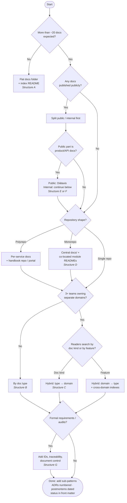

# Decision Guide

> **What:** A step-by-step way to choose doc types, an organizing model and storage for a project, using questions, a decision tree and a scoring matrix.
> **Read when:** setting up or reorganizing documentation. AI agents should apply this before creating a doc structure.

## TL;DR

- Answer the **8 questions** below and write the answers down. They become the "How these docs are organized" section.
- Follow the **decision tree** to get a primary model.
- If two models come out close, use the **scoring matrix**.
- When in doubt: **by doc type**, upgraded later to **type → domain** ([hybrid](../organizing/models/hybrid.md)).

---

## Step 1: Answer 8 questions

| # | Question | Why it matters | Typical answers → effect |
|---|---|---|---|
| Q1 | **How many docs will exist in 6 months?** | Size decides how much structure you need | <20 → flat · 20–150 → one-level folders · 150+ → two levels / hybrid |
| Q2 | **Who are the readers?** (list them) | Distinct audiences may need separate areas | Mostly developers → type · Users + devs → audience split · Many → audience → Diátaxis |
| Q3 | **Is any of it public?** | Visibility needs a hard split | Yes → `public/` vs `internal/` or separate repo ([internal-vs-public](../organizing/internal-vs-public.md)) |
| Q4 | **How many teams, and do they own separate domains?** | Ownership should match folders | 1 team → type · 3+ teams with domains → type → domain or domain → type |
| Q5 | **Repo shape?** | Decides co-location | Single repo → docs folder · Monorepo → central + co-located · Polyrepo → per-repo + portal |
| Q6 | **Who writes the docs?** | Decides storage | Engineers → repo · Mixed → repo + wiki for business · Non-technical → wiki/CMS (source) linked from repo |
| Q7 | **Are there several live versions?** | Versioned docs are expensive | No → Git only · Yes, public → versioned site |
| Q8 | **How formal must requirements be?** | Decides requirement doc types and IDs | Startup → PRD + stories · Client/regulated → BRD + SRS + traceability |

Bonus questions:

- **Will AI agents work in the repo?** → add `AGENTS.md`, stable IDs and a separate agent working folder ([ai-agent-docs](../doc-types/ai-agent-docs.md)).
- **Is there production on-call?** → you need runbooks, named by alert.

---

## Step 2: Decision tree



The structure letters refer to the trees in [folder-structures](../organizing/folder-structures.md).

---

## Step 3: Scoring matrix (when two options are close)

Weight each criterion 1–3 by importance to *your* project, score each model 1–3, then multiply and sum.

| Criterion | Weight (you) | By type | By audience | By domain | Diátaxis | Type → domain | Co-located + central |
|---|---|---|---|---|---|---|---|
| Newcomers find things fast | | 3 | 3 | 2 | 3 | 3 | 2 |
| Clear team ownership | | 1 | 2 | 3 | 1 | 3 | 3 |
| Scales past 150 docs | | 2 | 2 | 3 | 3 | 3 | 3 |
| Docs stay in sync with code | | 2 | 2 | 2 | 2 | 2 | 3 |
| Easy to start today | | 3 | 2 | 2 | 1 | 2 | 2 |
| Serves non-technical readers | | 2 | 3 | 3 | 3 | 2 | 1 |
| Safe public/internal split | | 1 | 3 | 1 | 2 | 1 | 1 |

**Example:** weights `[3, 2, 1, 2, 3, 1, 1]`. "By type" = 3·3+2·1+1·2+2·2+3·3+1·2+1·1 = **29**. "Type → domain" = 9+6+3+4+6+2+1 = **31**. Close, so start with by type, and plan domain subfolders for when folders grow.

---

## Step 4: Decide storage per doc type

Fill in this table (defaults in [storage-locations](../organizing/storage-locations.md#source-of-truth-per-doc-type-recommended-defaults)):

```markdown
| Doc type | Source of truth | Published to | Owner |
|---|---|---|---|
| Architecture & ADRs | repo `docs/architecture/` | internal site | tech lead |
| PRDs | repo `docs/requirements/` | — | product |
| User stories | Jira | — | product |
| Runbooks | repo `docs/operations/runbooks/` | — | platform team |
| User guide | repo `docs/public/` | help site | docs team |
```

---

## Step 5: Record the decision

Put the results in the docs index (and optionally an ADR such as "ADR-0002: Documentation structure"):

```markdown
## How these docs are organized

- **Model:** by doc type; domain subfolders when a folder exceeds 15 files.
- **Public docs:** none yet.
- **Storage:** Markdown in this repo is the source of truth, except user stories (Jira) and meeting notes (Notion).
- **Records:** ADRs numbered in `architecture/decisions/`; postmortems dated.
- **Metadata:** owner, status, last_reviewed in front matter.
- **Agents:** AGENTS.md at root; agent working files in `.agents/` (not in docs).
- **Review:** structure revisited every 6 months.
```

---

## For AI agents: applying this guide

When asked to create documentation for a project:

1. **Inspect** the repo: languages, monorepo or not, existing docs, `.github/`, existing agent files, API specs.
2. **Infer** answers to Q1–Q8 from the evidence. Ask the human only about what can't be inferred (usually Q2, Q3, Q6, Q8).
3. **Propose** the tree (from [folder-structures](../organizing/folder-structures.md)) and the "How these docs are organized" text **before** creating files.
4. **Create** only folders that will contain content now, each with a `README.md` index.
5. **Use** [templates](../templates/README.md) and fill in real project facts. Never leave a template's placeholder text in a "finished" doc.
6. **Keep** your own working notes and plans **out of** the human docs root.

---

**Related:** [scenarios](scenarios.md) · [dimensions](../organizing/dimensions.md) · [organizing overview](../organizing/README.md)
**Up:** [Choosing a structure](README.md)
