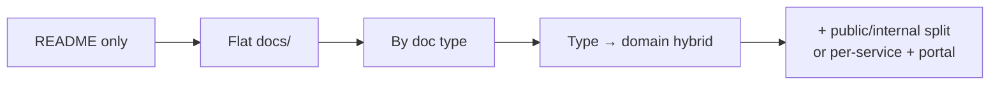

# Evolving the Structure

> **What:** When to change your documentation structure, and how to migrate without losing content or breaking links.
> **Read when:** your current structure has outgrown the project, or you're merging docs from several places.

## TL;DR

- Structures should **evolve with the project**. Start small and add levels when the signals appear.
- **Restructure incrementally**, one folder at a time, in separate PRs.
- **Inventory first, move second, fix links third, delete last.**
- Preserve history with `git mv`, and add redirects if docs are published.

---

## Typical evolution path



Most projects never need the last step, and that's fine.

## Signals that it's time to change

| Signal | Suggested change |
|---|---|
| A folder has more than ~20 files | Add secondary-dimension subfolders |
| "Where does this go?" asked repeatedly | Write rules; maybe change primary dimension |
| A second team starts contributing | Ownership via domain subfolders + CODEOWNERS |
| First external users / public docs | Public/internal split |
| Repo becomes a monorepo | Co-locate module docs |
| Docs in two tools disagree | Consolidate source of truth |
| Search returns mostly outdated pages | Lifecycle metadata + archive |
| Health check score below 5 ([smells](../organizing/smells-and-fixes.md#quick-health-check-10-minutes)) | Planned restructure |

## Migration procedure

### 1. Inventory

List every doc, including those in wikis and personal drives, in a table:

```markdown
| Current path | Type | Audience | Domain | Status | Owner | Action | New path |
|---|---|---|---|---|---|---|---|
| wiki/Payments Spec | PRD | product | billing | shipped | @anna | move+archive | docs/archive/prd-payments.md |
| docs/setup.md | guide | devs | — | active | @li | move | docs/getting-started/README.md |
| docs/notes-old.md | ? | ? | ? | stale | — | delete | — |
```

The **Action** column is one of: keep, move, merge, split, archive, delete.

### 2. Agree on the target

Write the new structure and rules (see [decision-guide step 5](decision-guide.md#step-5-record-the-decision)) and get team agreement **before** moving files.

### 3. Move in small batches

```bash
git mv docs/setup.md docs/getting-started/README.md
```

- One folder or doc type per PR. Reviewers can follow it, and conflicts stay small.
- Don't edit content and move files in the same commit, so Git can track the rename.

### 4. Fix links

- Run a link checker (lychee, markdown-link-check) after each batch.
- Search for old paths: `rg "docs/setup.md"`. Check code comments, AGENTS.md and CI configs too.
- For **published sites**, add redirects from old URLs (most generators support a redirects plugin or config).

### 5. Add indexes and metadata

Create `README.md` indexes in new folders and add front matter (owner, status) as you go.

### 6. Delete or archive

Remove what the inventory marked `delete`. Git keeps the history. Archive what has historical value, with a banner.

### 7. Announce

Tell the team, update onboarding docs and agent instruction files, and pin the "How these docs are organized" section.

---

## Consolidating from a wiki into the repo

1. Export pages to Markdown (most tools support it, or use a converter such as pandoc).
2. Clean up: fix headings, remove tool-specific macros, re-link images.
3. Leave a **stub** in the wiki: "Moved to `<repo link>`. This page is no longer maintained."
4. Restrict editing on the old pages to prevent forks.

## Splitting a giant document

1. Identify sections with different audiences or lifecycles ([one doc or two?](../doc-types/README.md#is-this-one-doc-or-two-quick-test)).
2. Create the new docs and move sections over.
3. Turn the original into a short **index page** linking to the parts, so existing links keep working.

---

**Related:** [smells-and-fixes](../organizing/smells-and-fixes.md) · [decision-guide](decision-guide.md) · [maintenance](../writing/maintenance.md)
**Up:** [Choosing a structure](README.md)
