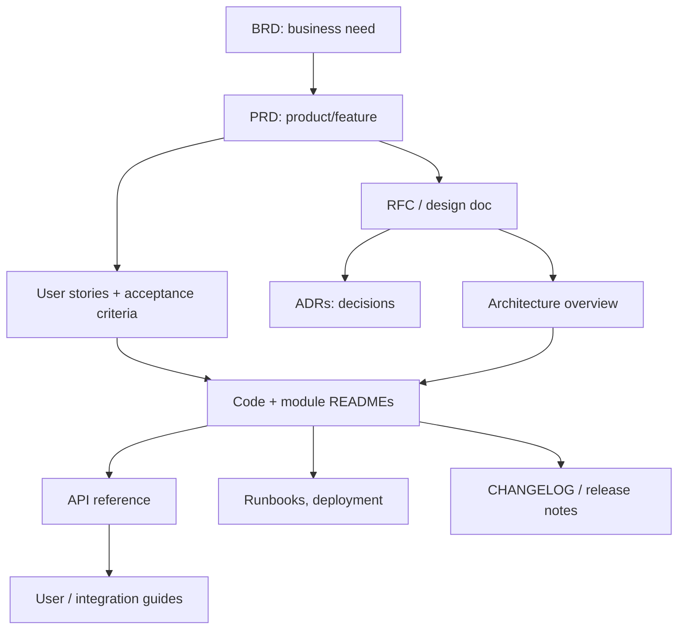

# Doc Types: Catalog

> **What:** Every common type of project document: what it's for, who reads it, when it's needed and where it usually lives.
> **Read when:** you need to decide *what* to write, or *where* a document belongs.

## TL;DR

- Pick the **type** before you write. The type decides the structure, tone and location.
- Not every project needs every type. Use the **"Needed when"** column.
- If a doc doesn't fit any type, it's probably **two docs**, or it isn't needed.

---

## Pages in this section

| Page | Covers |
|---|---|
| [developer-docs.md](developer-docs.md) | README, CONTRIBUTING, getting started, coding conventions, CHANGELOG, module READMEs, code comments vs docs |
| [api-docs.md](api-docs.md) | REST/OpenAPI, GraphQL, gRPC, events/AsyncAPI, reference vs guides, auth, errors, versioning |
| [business-requirements.md](business-requirements.md) | BRD, PRD, SRS/FRS, user stories, use cases, acceptance criteria, business rules, NFRs, domain glossary |
| [architecture-docs.md](architecture-docs.md) | Architecture overview, C4 diagrams, ADRs, RFCs/design docs, data models |
| [operations-docs.md](operations-docs.md) | Deployment, environments, runbooks, monitoring/alerts, incident postmortems, SLOs, disaster recovery |
| [user-docs.md](user-docs.md) | Tutorials, how-to guides, FAQ, troubleshooting, release notes, admin guides |
| [process-docs.md](process-docs.md) | Onboarding, team handbook, roadmap, meeting notes, decision log, SECURITY.md, CODE_OF_CONDUCT, LICENSE |
| [ai-agent-docs.md](ai-agent-docs.md) | AGENTS.md, CLAUDE.md, rules files, llms.txt, agent skills, agent-generated docs |

---

## Master table

| Doc | Family | Audience | Purpose | Needed when | Usual location | Lifecycle |
|---|---|---|---|---|---|---|
| `README.md` (root) | Developer | Everyone | What it is, quick start, map | **Always** | repo root | Living |
| `CONTRIBUTING.md` | Developer | Contributors | How to set up, branch, test, open PRs | >1 contributor | repo root | Living |
| `CHANGELOG.md` | Developer / user | Users, devs | What changed per release | Versioned releases | repo root | Append-only |
| Getting started / setup | Developer | New devs | First run in <30 min | Non-trivial setup | `docs/getting-started/` | Living |
| Coding conventions | Developer | Devs | Style, patterns, do/don't | >2 devs | `docs/development/` or CONTRIBUTING | Living |
| Module README | Developer | Devs | Purpose and usage of a package or service | Monorepo, libraries | next to code | Living |
| API reference | API | API consumers | Every endpoint/field/error | Any API | generated from spec, `docs/api/` | Living, versioned |
| API guides | API | API consumers | Auth, quick start, common tasks | Any external/shared API | `docs/api/guides/` | Living |
| BRD | Business | Stakeholders, PM | Business need, goals, scope | Large initiatives, client projects | `docs/requirements/` or wiki | Approved → frozen |
| PRD | Business | PM, design, eng, QA | What to build and why | Each feature/epic | `docs/requirements/` or `docs/product/` | Draft → approved → shipped |
| SRS / FRS | Business | Eng, QA, client | Detailed formal requirements | Contracts, regulated domains | `docs/requirements/` | Versioned, signed off |
| User stories + AC | Business | Eng, QA | Small testable requirements | Agile delivery | issue tracker (mirrored in repo if needed) | Per sprint |
| Business rules | Business | Product, QA, eng | Canonical rules of the domain | Complex domain logic | `docs/requirements/rules/` | Living |
| Domain glossary | Business | Everyone | Shared vocabulary | Always worthwhile | `docs/glossary.md` | Living |
| Architecture overview | Architecture | Devs, architects | Big picture of the system | >1 component | `docs/architecture/` | Living |
| ADR | Architecture | Devs, future devs | Why a decision was made | Any significant decision | `docs/architecture/decisions/` | Immutable (superseded, not edited) |
| RFC / design doc | Architecture | Devs, reviewers | Propose before building | Large or risky changes | `docs/rfcs/` or `docs/design/` | Draft → accepted/rejected → archived |
| Deployment guide | Operations | DevOps, devs | How to release | Any deployed system | `docs/operations/` | Living |
| Runbook | Operations | On-call | Fix a specific problem fast | Production systems | `docs/operations/runbooks/` | Living |
| Postmortem | Operations | Eng, management | Learn from incidents | After incidents | `docs/operations/postmortems/` | Immutable |
| Tutorial / how-to | User | End users, devs | Learn / do a task | Users exist | `docs/guides/` or docs site | Living |
| FAQ / troubleshooting | User | Users, support | Answer common problems | Repeated questions | docs site | Living |
| Release notes | User | Users, customers | What's new, in user terms | Customer-facing releases | docs site / `docs/releases/` | Append-only |
| Onboarding | Process | New team members | First week plan | Growing team | `docs/onboarding/` or handbook | Living |
| Roadmap | Process | Stakeholders | Planned direction | Product teams | wiki / `docs/product/` | Living |
| Meeting notes / decision log | Process | Team | Record decisions | Team ceremonies | wiki / `docs/meetings/` | Append-only |
| `SECURITY.md` | Process | Security reporters | How to report vulnerabilities | Public repos | repo root or `.github/` | Living |
| `AGENTS.md` / `CLAUDE.md` | AI agent | AI agents | How to work in this repo | Using AI coding agents | repo root (+ subfolders) | Living |

---

## How doc families relate

The flow is: **why** (business) → **what** (product) → **how** (architecture/design) → **built** (code + reference) → **run** (operations) → **use** (user docs).

---

## Is this one doc or two? Quick test

Split a document when any of these is true:

- It has **two different audiences** (for example business rules and SQL schema).
- It has **two different lifecycles** (an immutable decision and a living guide).
- It mixes **learning** and **looking up** (tutorial and reference).
- Its table of contents has **more than about 12 H2 sections**.
- People link to **one part** of it far more than the rest.

---

**Up:** [Guide home](../README.md) · **Next section:** [Organizing](../organizing/README.md)
