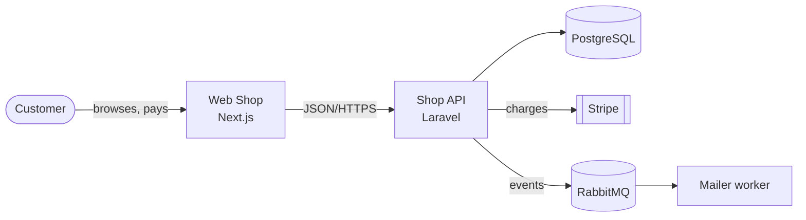
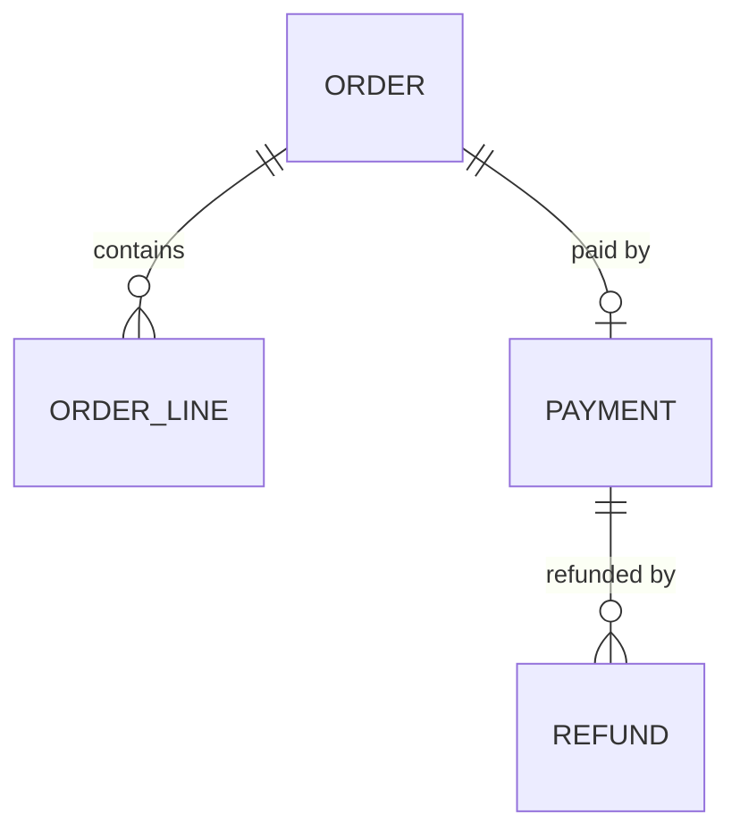

# Architecture Docs

> **What:** Docs that explain how the system is structured and why: architecture overview, C4 diagrams, ADRs, RFCs/design docs and data models.
> **Read when:** the system has more than one moving part, or you're making a decision someone will later ask "why?" about.

## TL;DR

- Keep **one living architecture overview** that covers the big picture in 1–3 pages with diagrams.
- Use **C4** levels to draw diagrams at the right zoom: Context → Containers → Components.
- Record each significant decision as an **ADR**: short, numbered and immutable. Supersede it rather than editing it.
- Propose big changes **before** building them in an **RFC / design doc**.
- Prefer **diagrams as code** (Mermaid, Structurizr, PlantUML) so they're reviewable and diffable.

---

## The architecture doc set

| Doc | Living or immutable | Location |
|---|---|---|
| Architecture overview | Living | `architecture/README.md` or `architecture/overview.md` |
| C4 diagrams | Living | `architecture/diagrams/` or embedded in overview |
| ADRs | **Immutable** (status changes only) | `architecture/decisions/NNNN-title.md` |
| RFCs / design docs | Immutable after decision | `rfcs/` or `architecture/design/` |
| Data model / ERD | Living | `architecture/data-model.md` |
| Integration map | Living | `architecture/integrations.md` |
| Quality attributes / NFRs | Living | link to [requirements NFRs](business-requirements.md#non-functional-requirements-nfrs) |

---

## Architecture overview

One page that a new senior engineer reads on day one.

| Section | Contents |
|---|---|
| Purpose & context | What the system does and who/what it talks to (C4 Context diagram) |
| Building blocks | Main apps/services/databases (C4 Container diagram) + one line each |
| Key flows | 2–4 sequence diagrams for the most important journeys |
| Technology stack | Table: layer → tech → why (link ADRs) |
| Cross-cutting concerns | Auth, logging, error handling, config, i18n |
| Deployment view | Where it runs (or link to operations docs) |
| Key decisions | List of the most important ADRs |
| Known limitations / tech debt | Honest list |

A popular formal alternative is **arc42**, a 12-section template. It's useful for large or regulated systems, but too much for most small projects.

---

## C4 model

Diagram at four zoom levels. Most projects only need levels 1 and 2, plus level 3 for complex parts.

| Level | Shows | Audience | Needed |
|---|---|---|---|
| 1. **System Context** | Your system as a box, users and external systems around it | Everyone, including non-technical | Always |
| 2. **Container** | Deployable/runnable units: web app, API, DB, queue | Engineers, ops | Almost always |
| 3. **Component** | Major components inside one container | Engineers of that container | For complex containers |
| 4. **Code** | Classes/tables | Rarely worth maintaining by hand | Generate if needed |



More diagram guidance: [diagrams-and-visuals](../writing/diagrams-and-visuals.md).

---

## Architecture Decision Records (ADRs)

An ADR captures **one** decision: the context, what was decided and what follows from it.

**Rules:**

- Number them sequentially: `0001-record-architecture-decisions.md`, `0002-use-postgresql.md`.
- Keep them **short**, 1–2 pages.
- Make them **immutable** once accepted. To change a decision, write a new ADR that **supersedes** the old one, and update the old one's status only.
- Statuses: `proposed` → `accepted` | `rejected` → later `deprecated` | `superseded by ADR-00NN`.
- Keep an index (`decisions/README.md`) listing number, title, status and date.

**Write an ADR when the decision:**

- is hard or expensive to reverse (database, framework, cloud, sync vs async),
- affects several teams or modules,
- was controversial or had serious alternatives,
- will make a future developer ask "why on earth did they…?"

```markdown
# ADR-0012: Use Stripe for card payments

- **Status:** accepted
- **Date:** 2026-03-14
- **Deciders:** @anna, @li, team-payments

## Context
We need card payments in 6 EU countries by Q3. Team has no PCI expertise...

## Decision
We will use Stripe Payments with Stripe Elements on the frontend.

## Alternatives considered
- Adyen: better rates at scale, longer onboarding (8+ weeks).
- In-house via acquirer: requires PCI DSS Level 1, out of reach.

## Consequences
- ✅ PCI scope reduced to SAQ A.
- ❌ Vendor lock-in on payment method storage.
- Follow-up: abstract provider behind `PaymentGateway` interface.
```

Formats: **Nygard** (original: Context/Decision/Consequences), **MADR** (adds options and pros/cons), **Y-statements** (one-sentence format). Pick one and template it.

Template: [templates/adr-template.md](../templates/adr-template.md) · Organization pattern: [sequential-and-dated](../organizing/models/sequential-and-dated.md)

---

## RFCs and design docs

An **RFC** or **design doc** proposes a solution *before* building it, so others can find problems while they're still cheap to fix.

| | ADR | RFC / design doc |
|---|---|---|
| When | At or after the decision | Before the decision |
| Size | 1–2 pages | 3–15 pages |
| Scope | One decision | A whole feature/system change, may produce several ADRs |
| Content | Context, decision, consequences | Problem, goals, proposed design, alternatives, rollout, risks |

### Typical design doc sections

1. Summary (one paragraph)
2. Context and problem
3. Goals / non-goals
4. Proposed design: diagrams, APIs, data model changes
5. Alternatives considered
6. Risks, security and privacy, performance
7. Migration / rollout / rollback plan
8. Testing and observability
9. Open questions
10. Decision record (outcome, date, links to ADRs)

### RFC lifecycle

```
draft → in-review → accepted | rejected | withdrawn → implemented → archived
```

Store by number (`rfcs/0042-multi-currency.md`) with status in front matter, or by status folder. See [by-lifecycle](../organizing/models/by-lifecycle.md).

Template: [templates/rfc-design-doc-template.md](../templates/rfc-design-doc-template.md)

---

## Data model docs

- An **ERD** (Mermaid `erDiagram`) for core entities. Don't include every table.
- A **table of entities** with meaning, owner module and key invariants.
- **Generate** a full schema doc from the database or migrations if needed (for example `tbls`, `SchemaSpy`). Don't hand-maintain it.



---

**Related:** [business-requirements](business-requirements.md) · [operations-docs](operations-docs.md) · [diagrams-and-visuals](../writing/diagrams-and-visuals.md)
**Up:** [Doc types](README.md)
