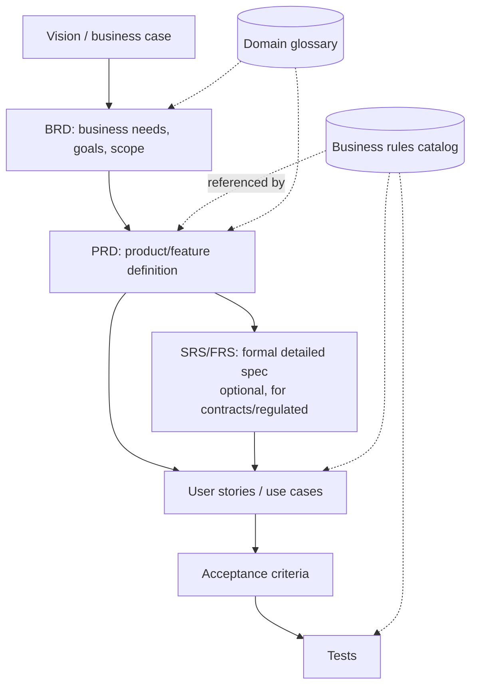

# Business & Requirements Docs

> **What:** Documents that define *why* something is built and *what* it must do: BRD, PRD, SRS/FRS, user stories, use cases, acceptance criteria, business rules, NFRs and the domain glossary.
> **Read when:** starting a project or feature, writing specs with stakeholders, or deciding how formal requirements need to be.

## TL;DR

- Requirements go from **broad to specific**: BRD (business why) → PRD (product what) → user stories / use cases (detailed behavior) → acceptance criteria (testable).
- **Choose formality by risk.** Startups need a lean PRD and stories. Contracts and regulated domains need an SRS with IDs and traceability.
- Keep **business rules in one catalog**, give each one an ID, and link to them from stories, code and tests.
- Every requirement must be **testable**. If QA can't verify it, rewrite it.
- Maintain a **domain glossary**. Most requirement bugs are vocabulary bugs.

---

## The requirements ladder



| Level | Document | Answers | Owner | Lifespan |
|---|---|---|---|---|
| 1 | **BRD** | Why do it? What business outcome? | Business sponsor / BA | Frozen after approval |
| 2 | **PRD** | What are we building, for whom, and how will we know it works? | Product manager | Until feature ships, then archived |
| 3 | **SRS / FRS** | Exactly what must the system do? (formal) | BA / systems analyst | Versioned, signed off |
| 4 | **User stories / use cases** | How does each user interaction behave? | PM / team | Per iteration |
| 5 | **Acceptance criteria** | How do we verify it? | PM + QA | With the story |
| — | **Business rules** | What are the domain's rules? | Domain owner | **Living** |
| — | **NFRs** | How well must it work? | Architect / PM | Living |
| — | **Glossary** | What do our words mean? | Everyone | Living |

---

## Choosing the right level of formality

| Context | Recommended set |
|---|---|
| Solo / early startup | One-page PRD per feature + stories in tracker + glossary |
| Product company, agile teams | PRD per epic + stories with AC + business rules catalog + NFRs |
| Agency / client project | BRD (signed) + PRD/SRS + stories + change log of requirements |
| Enterprise / regulated (finance, health, gov) | BRD + SRS with requirement IDs + traceability matrix + formal sign-off |
| Internal tool | Short PRD or a design doc that includes requirements |

Rule: **the more expensive a misunderstanding is, the more formal the document.**

---

## BRD (Business Requirements Document)

**Purpose:** justify and frame an initiative in business terms. **No solutions or technology.**

| Section | Contents |
|---|---|
| Executive summary | Problem and expected outcome in 3–5 sentences |
| Background / problem | Current situation, pain, evidence (data) |
| Business objectives | Measurable goals (SMART): "Reduce refund handling time from 3 days to 4 hours" |
| Stakeholders | Who is affected, who decides (RACI optional) |
| Scope | In scope / **out of scope** (explicitly) |
| Business requirements | High-level needs, numbered `BR-01`… |
| Constraints & assumptions | Budget, deadlines, regulation, dependencies |
| Risks | With impact and mitigation |
| Success metrics | How the outcome will be measured |
| Approval | Names, dates |

Template: [templates/brd-template.md](../templates/brd-template.md)

---

## PRD (Product Requirements Document)

**Purpose:** define a product or feature so design, engineering and QA build the same thing.

| Section | Contents |
|---|---|
| Header | Status, owner, reviewers, target release, links (BRD, designs, epics) |
| Problem statement | User problem, evidence, why now |
| Goals & non-goals | What success is; **what this is explicitly not** |
| Users / personas | Who it's for |
| User journeys / scenarios | Narrative of key flows |
| Requirements | Functional requirements, prioritized (MoSCoW or P0/P1/P2), with IDs |
| Business rules | Links to the rules catalog (don't redefine rules here) |
| NFRs | Performance, security, accessibility specifics |
| Designs | Links to Figma/wireframes |
| Success metrics | KPIs + how they're measured |
| Open questions | With owner and due date |
| Release plan | Phases, feature flags, rollout |

✅ A good PRD is 2–6 pages. If it's longer, split it into sub-features.

Template: [templates/prd-template.md](../templates/prd-template.md)

---

## SRS / FRS (Software / Functional Requirements Specification)

**Purpose:** formal, complete, verifiable specification. Typical for contracts, tenders, safety-critical or regulated systems (structure often based on ISO/IEC/IEEE 29148).

Key properties of each requirement: **unique ID, single statement, testable, prioritized, traceable**.

```markdown
### FR-PAY-012: Refund approval threshold
- **Statement:** The system shall require manager approval for refunds above €500.00.
- **Priority:** Must
- **Source:** BR-04, Finance policy FP-2025-7
- **Rationale:** Fraud prevention.
- **Verification:** Test, see TC-PAY-044, TC-PAY-045
```

Use "shall" for mandatory, "should" for desired, and "may" for optional, and use them consistently.

### Traceability matrix

| Business req | Functional req | Story | Test |
|---|---|---|---|
| BR-04 | FR-PAY-012 | PAY-231 | TC-PAY-044 |

In Markdown projects this can be a table in `requirements/traceability.md` or be generated from front matter IDs.

---

## User stories

Format:

```markdown
**As a** support agent
**I want** to issue a partial refund from the order page
**so that** I can resolve damaged-item complaints without involving finance.
```

Quality check, **INVEST**: Independent, Negotiable, Valuable, Estimable, Small, Testable.

Where they live: usually the **issue tracker** (Jira, Linear, GitHub Issues). Mirror them into Markdown only if the repo is the source of truth (for example a client deliverable, or AI-agent-driven development). In that case, store them by feature: `requirements/<feature>/stories/`.

Template: [templates/user-story-template.md](../templates/user-story-template.md)

---

## Acceptance criteria

Use **Given / When / Then** (Gherkin style) for behavior, or a checklist for simple cases:

```gherkin
Scenario: Refund above approval threshold
  Given a captured payment of €800
  And I am a support agent
  When I request a refund of €600
  Then the refund status is "pending_approval"
  And a finance manager receives an approval request
```

✅ Cover the happy path, the main alternatives, the edge cases (zero, max, duplicates) and the error cases.
❌ Don't write "works correctly", "is fast" or "user-friendly". None of those can be tested.

---

## Use cases

More detailed than stories. Use them when flows have many branches or several actors.

| Field | Example |
|---|---|
| ID / name | UC-07 Issue refund |
| Primary actor | Support agent |
| Preconditions | Payment is captured |
| Main success scenario | 1. Agent opens order… 2. … |
| Alternative flows | 3a. Amount > €500 → approval flow |
| Exceptions | Payment provider unavailable |
| Postconditions | Refund recorded, customer notified |
| Business rules | BR-PAY-04 |

Template: [templates/use-case-template.md](../templates/use-case-template.md)

---

## Business rules catalog

Business rules are the **most reused and most duplicated** knowledge in a project. Give them **one home**, give each an **ID**, and **link** to them from PRDs, stories, code and tests.

```markdown
| ID | Rule | Source | Owner | Since |
|---|---|---|---|---|
| BR-PAY-04 | Refunds over €500 require finance manager approval. | Finance policy FP-2025-7 | Finance | 2025-03 |
| BR-PAY-05 | Refunds are allowed up to 90 days after capture. | Terms of service §8 | Legal | 2024-01 |
```

Organize by domain: `requirements/rules/payments.md`, `requirements/rules/shipping.md`. In code and tests, reference the ID:

```php
// BR-PAY-04: refunds over €500 require approval
```

That makes "where is this rule implemented?" answerable with a single grep.

---

## Non-functional requirements (NFRs)

Quality attributes, always **measurable**:

| Category | ❌ Vague | ✅ Measurable |
|---|---|---|
| Performance | "Fast checkout" | "p95 checkout API latency < 300 ms at 200 req/s" |
| Availability | "Highly available" | "99.9% monthly uptime for checkout" |
| Security | "Secure" | "PII encrypted at rest (AES-256); OWASP ASVS L2" |
| Accessibility | "Accessible" | "WCAG 2.2 AA for all customer screens" |
| Scalability | "Scales" | "Handles 10× Black Friday peak (≈5k orders/min)" |

Store system-wide NFRs in one doc (`requirements/non-functional.md`). Put feature-specific ones in the PRD.

---

## Domain glossary

A table of terms with precise definitions and the code names they map to:

| Term | Definition | In code | Not to be confused with |
|---|---|---|---|
| **Capture** | Moving authorized funds from the customer | `Payment::capture()` | Authorization |
| **Partial refund** | Refund of less than the captured amount | `Refund(type=partial)` | Chargeback |

Put it at `<docs-root>/glossary.md` and link it from README. It's one of the most valuable docs for new team members **and** for AI agents.

---

## Where business docs should live

| Situation | Recommendation |
|---|---|
| Engineers and product both use Git | Markdown in repo: `requirements/` organized [by domain](../organizing/models/by-domain.md) |
| Business authors don't use Git | Wiki/Notion as source of truth; **link** from the repo, don't copy |
| Client deliverable / sign-off needed | Markdown → PDF export with version and approval table, or a formal document system |
| Specs drive AI-assisted development | Markdown in repo (agents can read it) with stable requirement IDs |

Lifecycle tip: PRDs and BRDs go **stale after shipping**. Move them to `archive/` or mark them `status: shipped`, and keep the **rules catalog and glossary** as the living truth. See [by-lifecycle model](../organizing/models/by-lifecycle.md).

---

**Related:** [architecture-docs](architecture-docs.md) · [organizing by domain](../organizing/models/by-domain.md) · [PRD template](../templates/prd-template.md)
**Up:** [Doc types](README.md)
