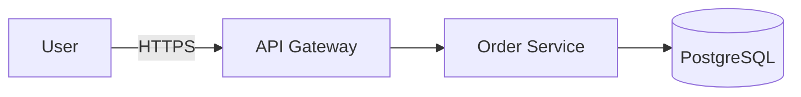

# Markdown Essentials

> **What:** Everything you need to write project docs in Markdown: core syntax, GitHub-Flavored Markdown (GFM), front matter, diagrams, callouts and linking rules.
> **Read when:** you're new to Markdown, or you want your docs to render correctly on GitHub/GitLab, in IDEs and on doc sites.

## TL;DR

- Use **CommonMark + GFM**. It renders the same almost everywhere.
- Use **one H1 per file** and don't skip heading levels.
- Use **relative links** between docs and **always** give fenced code blocks a language tag.
- Use **YAML front matter** for metadata (owner, status, dates).
- Use **Mermaid** for diagrams kept as text, so they can be diffed and reviewed.

---

## Why Markdown

| Strength | Why it matters |
|---|---|
| Plain text | Works with Git: diffs, blame, PR reviews |
| Renders everywhere | GitHub, GitLab, Bitbucket, IDEs, static site generators |
| Low barrier | Engineers, PMs and analysts can all edit it |
| Tool ecosystem | Linters, link checkers, doc site generators |
| AI-friendly | LLMs read and write Markdown natively, with little token overhead |

**When Markdown is not enough:** heavy formatting for print or legal documents (use a DOCX/PDF pipeline), large structured data (YAML/JSON/CSV next to the doc), and machine-readable API contracts (OpenAPI/GraphQL SDL, with Markdown as the explanation).

Alternatives you may meet: **AsciiDoc** (richer, for books and complex manuals), **reStructuredText** (Python/Sphinx ecosystem), **MDX** (Markdown + React components, for Docusaurus and similar).

---

## Core syntax cheat sheet

````markdown
# H1: document title (exactly one per file)
## H2: main sections
### H3: subsections (rarely go deeper than H4)

Paragraph text. **Bold** for key terms, *italic* for emphasis, `inline code` for
identifiers, file names, commands and values.

- Unordered list item
- Another item
  - Nested item (indent 2 spaces)

1. Ordered step
2. Next step

[Link text](relative/path.md)
[Link to a section](relative/path.md#section-heading)


> Blockquote: use for notes, summaries, quotes.

---  (horizontal rule)

```bash
npm install   # fenced code block with a language tag
```
````

## GitHub-Flavored Markdown (GFM) extras

### Tables

```markdown
| Option | Default | Description |
|---|:---:|---|
| `timeout` | `30` | Seconds before the request is cancelled |
```

Alignment: `:---` left, `:---:` center, `---:` right. Keep table cells short; if a cell needs a paragraph, use a list or subsection instead.

### Task lists

```markdown
- [x] Write the draft
- [ ] Get review from the API owner
```

### Callouts (alerts)

Supported by GitHub, and by many doc sites with a plugin:

```markdown
> [!NOTE]
> Useful information the reader should know.

> [!TIP]
> Optional advice that helps.

> [!IMPORTANT]
> Key information needed to succeed.

> [!WARNING]
> Urgent info that needs immediate attention to avoid problems.

> [!CAUTION]
> Risks or negative outcomes of an action.
```

Portable fallback that works everywhere: `> ⚠️ **Warning:** text`.

### Collapsible sections

```markdown
<details>
<summary>Full error log</summary>

Long content here. Leave a blank line after the summary tag.

</details>
```

Use these for long logs or optional detail. Don't hide essential steps in them.

### Footnotes, strikethrough, autolinks

```markdown
A claim that needs a source.[^1]
~~deprecated text~~
https://example.com becomes a link automatically.

[^1]: Source or extra detail.
```

---

## Front matter (metadata)

A YAML block at the very top of the file. GitHub shows it as a table, doc site generators use it, and scripts or AI agents can parse it.

```markdown
---
title: Payment Refund Rules
owner: team-payments
status: active            # draft | review | active | deprecated | archived
audience: [product, qa, developers]
last_reviewed: 2026-10-01
tags: [payments, refunds, business-rules]
---

# Payment Refund Rules
```

Keep the field set **small and consistent across the project**. The recommended fields are in [navigation-and-metadata](../organizing/navigation-and-metadata.md#front-matter-schema).

---

## Diagrams as code: Mermaid

GitHub, GitLab and most doc sites render Mermaid inside fenced blocks:

````markdown

````

Common diagram types: `flowchart`, `sequenceDiagram`, `erDiagram`, `stateDiagram-v2`, `classDiagram`, `gantt`, `C4Context`. More in [diagrams-and-visuals](../writing/diagrams-and-visuals.md).

---

## Linking rules

| Rule | Example | Why |
|---|---|---|
| Use **relative** paths between docs | `../api/README.md` | Works on every host, in forks and offline |
| Link to a **file**, not to a folder | `api/README.md`, not `api/` | Some renderers don't resolve folder links |
| Use **descriptive link text** | `see [refund rules](...)` | "click here" means nothing to screen readers or AI |
| Section anchors are **lowercase, hyphenated** | `#rotate-the-api-key` | GitHub's auto-generated anchor format |
| Use absolute URLs **only for external** resources | `https://spec.openapis.org/...` | |
| Don't link to a **branch-specific blob URL** for internal docs | ❌ `github.com/org/repo/blob/main/docs/x.md` | Breaks in forks and old versions |

**Anchor generation (GitHub):** lowercase, spaces become `-`, most punctuation is removed. `## 2. By Audience` → `#2-by-audience`.

---

## Formatting conventions (recommended)

| Topic | Convention |
|---|---|
| Line length | No hard wrap, or one sentence per line (gives cleaner diffs). Pick one per repo. |
| Lists | `-` for bullets, `1.` for every ordered item (renderer numbers them) or real numbers. Be consistent. |
| Emphasis | `**bold**` and `*italic*`. Avoid `__` and `_` variants. |
| Code blocks | Always fenced with a language: `bash`, `json`, `yaml`, `http`, `sql`, `text` |
| Commands | Show the command alone, without the `$` prompt, so it copy-pastes cleanly. Show output in a separate `text` block. |
| Headings | Sentence case: "Configure the database", not "Configure The Database" |
| Images | Store next to the doc in `images/` or `assets/`, with meaningful names and alt text |
| File end | Single trailing newline |

Enforce these with **markdownlint**; see [maintenance](../writing/maintenance.md#automation).

---

**Related:** [style-guide](../writing/style-guide.md) · [diagrams-and-visuals](../writing/diagrams-and-visuals.md) · [glossary](glossary.md)
**Up:** [Foundations](README.md)
