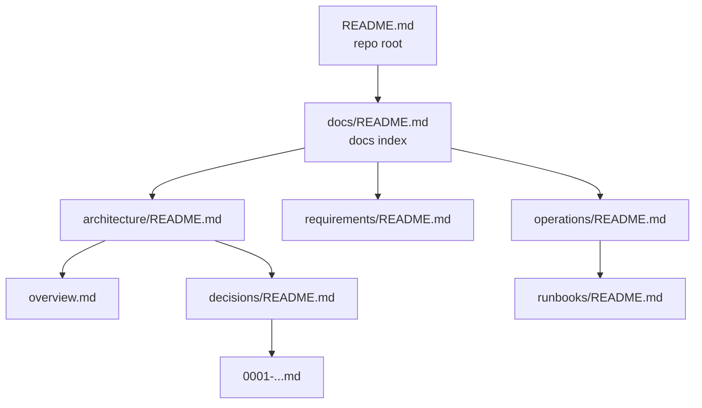

# Navigation & Metadata

> **What:** How to make docs findable: folder index pages, cross-linking, breadcrumbs, front matter schema, status, tags and ownership.
> **Read when:** your structure exists but people (or AI agents) still can't find things, or docs go stale unnoticed.

## TL;DR

- **Every folder has a `README.md`** that lists its contents with one line each.
- **Every page links up** (to its folder index) and **across** (to related pages).
- Use a **small, fixed front matter schema** (owner, status, last reviewed) and validate it.
- Show **status** visibly on the page, not just in metadata.
- Navigation is a **tree of indexes**: root README → docs index → folder indexes → pages.

---

## The index tree



Every page is reachable from the root in **at most 3–4 clicks**, and no page is an **orphan** (unlinked).

## Folder index (README.md) pattern

```markdown
# Operations

> Deploying, configuring and running the system in production.
> **Owner:** team-platform

| Page | Description |
|---|---|
| [environments.md](environments.md) | Environments, URLs, access |
| [deployment.md](deployment.md) | Release and rollback procedure |
| [runbooks/](runbooks/README.md) | One runbook per alert |
| [postmortems/](postmortems/README.md) | Incident write-ups, newest first |
```

Keep descriptions to one line. The index is a **menu**, not a summary of the content.

## The docs root index

`docs/README.md` (or your docs root's index) should contain:

1. **Who these docs are for**, with an audience → start-page table.
2. **Map**: the folders and what each holds.
3. **How these docs are organized**: the rules ([hybrid](models/hybrid.md#writing-down-the-rules)).
4. **How to contribute docs**: templates, review, ownership.
5. **Most-used pages**: the 5–10 pages people open most.

## Cross-linking rules

| Link type | Where | Example |
|---|---|---|
| **Up** | Bottom (or top) of every page | `**Up:** [Operations](README.md)` |
| **Related** | Bottom of page | `**Related:** [deployment](deployment.md) · [ADR-0012](...)` |
| **Inline** | Where a concept first appears | `…requires [approval](../requirements/rules.md#br-pay-04)…` |
| **Canonical** | Instead of duplicating | `> Canonical source: [refund rules](...)` |
| **Back-references** | From code to docs | `// See docs/requirements/billing/rules.md#br-bil-04` |

✅ Link to **specific sections** with anchors when you can.
❌ Don't write "see the docs". Say *which* doc.

---

## Front matter schema

Keep it small and the same everywhere. Recommended fields:

```yaml
---
title: Refund rules                 # optional if H1 is the same
owner: team-billing                 # team or @person responsible for accuracy
status: active                      # draft | review | active | deprecated | archived
last_reviewed: 2026-10-01           # ISO date, updated on every real review
audience: [product, qa, developers] # optional
tags: [refunds, payments]           # optional, from a controlled list
---
```

Extra fields for specific types:

| Doc type | Extra fields |
|---|---|
| ADR | `id`, `date`, `deciders`, `supersedes`, `superseded_by` |
| RFC / PRD | `id`, `reviewers`, `target_release`, `decision_date` |
| Requirements | `id`, `priority`, `source`, `verification` |
| Runbook | `alert`, `severity`, `service` |
| Versioned | `since`, `deprecated_in` |

**Validate it** in CI with a small script or a JSON-schema check over front matter, so typos like `staus:` or unknown statuses fail the build.

### Status vocabulary

| Status | Meaning | Visible banner |
|---|---|---|
| `draft` | Being written; may be wrong | 🟡 Draft |
| `review` | Ready for feedback | 🔵 In review |
| `active` | Current and maintained | (none) |
| `deprecated` | Still valid for old versions / being replaced | 🟠 Deprecated, link to replacement |
| `archived` | Historical only | 📦 Archived |

---

## Tags

Tags give you **many-to-many** grouping that folders can't. Use them when:

- Docs sites can build tag pages (Docusaurus, MkDocs Material and others).
- You need cross-cutting views: `security`, `gdpr`, `performance`.

Rules: use a **controlled list** (`tags.md` or the site config), keep them lowercase, and give a page no more than about 5 tags.

---

## Search

- Published docs sites: built-in search, or Algolia DocSearch for large sites.
- Repos: GitHub/GitLab code search, and `grep`/`rg` for agents and developers.
- Help search by **using the words readers use**, including synonyms ("refund / chargeback / money back") in the text or in a `keywords:` field.

---

## Checklist

- [ ] Root README links to the docs index
- [ ] Every folder has a README index
- [ ] Every page has an "Up" link
- [ ] No orphan pages (check with a script or link checker)
- [ ] Front matter schema documented and validated
- [ ] Status visible on draft/deprecated/archived pages

---

**Related:** [naming-conventions](naming-conventions.md) · [maintenance](../writing/maintenance.md) · [writing-for-ai-agents](../writing/writing-for-ai-agents.md)
**Up:** [Organizing](README.md)
