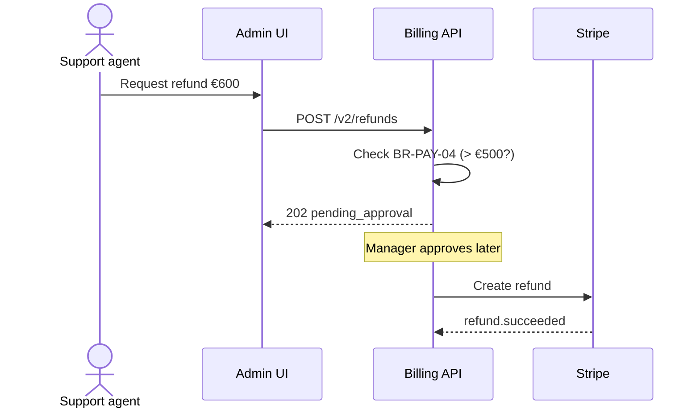
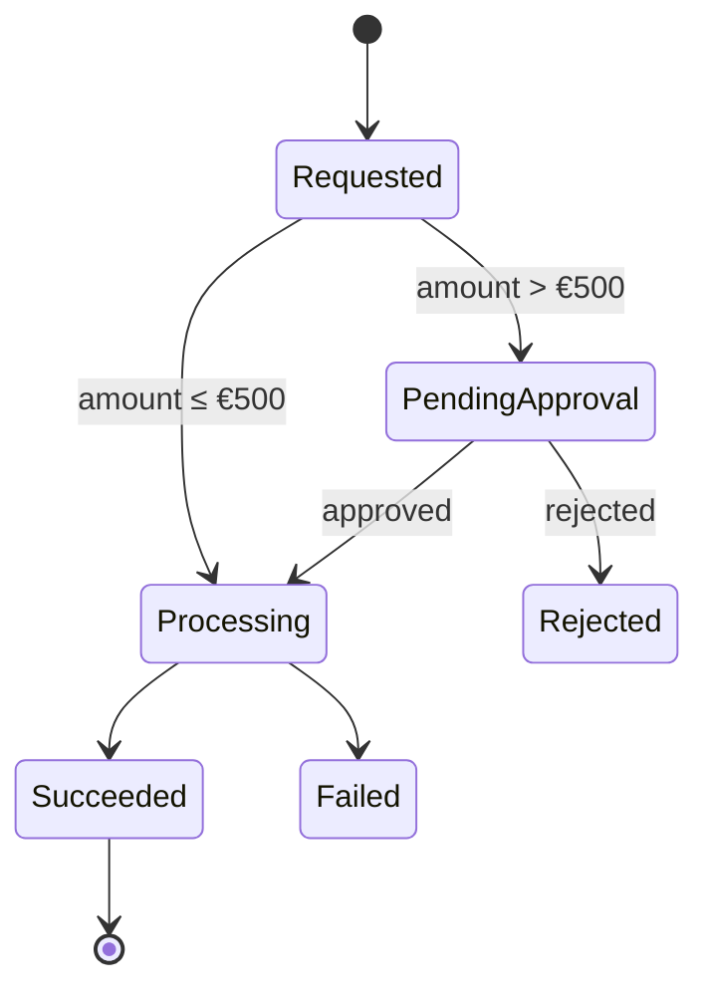

# Diagrams & Visuals

> **What:** When to use diagrams, screenshots and tables, which diagram type fits which question, and how to keep visuals maintainable.
> **Read when:** a doc describes structure, flow, relationships or a UI.

## TL;DR

- Use a diagram when the reader needs to see **structure or flow**. Use text when they need **steps or facts**.
- Prefer **diagrams as code** (Mermaid first). They're diffable, reviewable and readable by AI agents.
- **One diagram, one message.** Give it a title and a legend, and keep it under about 15 boxes.
- Screenshots go stale fast. Crop tightly, annotate, and use them only where the UI is the point.
- Always pair a visual with **text that states its key point**, for accessibility and for AI agents.

---

## Which visual for which question

| Reader's question | Visual | Mermaid type |
|---|---|---|
| What talks to what? | Context / container diagram | `flowchart` or `C4Context` |
| In what order do things happen across components? | Sequence diagram | `sequenceDiagram` |
| What are the steps and decisions? | Flowchart | `flowchart` |
| What states can this be in? | State diagram | `stateDiagram-v2` |
| How is data related? | ER diagram | `erDiagram` |
| What's the class/module structure? | Class diagram | `classDiagram` |
| What's the timeline / plan? | Gantt / timeline | `gantt`, `timeline` |
| How do options compare? | **Table**, not a diagram | — |
| What does the screen look like? | Screenshot (annotated) | — |

## Mermaid examples

### Sequence diagram



### State diagram



## Diagram tools

| Tool | Format | Best for |
|---|---|---|
| **Mermaid** | Text in Markdown | Default choice; renders on GitHub/GitLab/most doc sites |
| **PlantUML** | Text | Complex UML; needs a renderer |
| **Structurizr DSL** | Text (C4 model) | Many C4 views from one model |
| **D2** | Text | Nicer layouts, modern syntax |
| **draw.io / diagrams.net** | `.drawio.svg` (editable SVG) | Freeform diagrams that stay editable in the repo |
| **Excalidraw** | `.excalidraw` / `.svg` | Sketchy whiteboard style |
| **Figma / Miro** | External | Design and workshops. Link to them, export a PNG for docs. |

Rule: if the diagram **can't be edited from the repo**, it'll go stale. Store the source next to the export.

## Diagram rules

- ✅ Give it a **title** or a caption sentence above it: "Figure: refund flow with approval".
- ✅ Show **one level of abstraction** per diagram ([C4](../doc-types/architecture-docs.md#c4-model)).
- ✅ **Label arrows** with what flows (`JSON/HTTPS`, `events`, `charges`).
- ✅ Use the same **names as in code and the glossary**.
- ✅ Keep it under about **15 elements**. Split bigger ones.
- ❌ Don't rely on color alone to carry meaning.
- ❌ Don't put critical information *only* in the diagram. State it in text too.

## Screenshots

| ✅ Do | ❌ Don't |
|---|---|
| Crop to the relevant area | Full-screen captures |
| Annotate (box/arrow) the element to click | Leave the reader searching |
| Use test data | Show real customer data |
| Name files meaningfully: `refund-dialog.png` | `Screenshot 2026-10-09 at 14.02.png` |
| Store next to the doc: `images/` | Hotlink from external hosts |
| Write alt text: `` | `` |

Use screenshots only where the visual adds value. For a "click **Settings → Billing**" step, text is enough.

## Tables as visuals

Tables are often the best "diagram" for:

- comparisons (options × criteria),
- mappings (alert → runbook, rule → code),
- parameters (name, type, default, description).

## Asset organization

```
architecture/
├── README.md
└── images/
    ├── c4-context.drawio.svg     editable source + render
    └── checkout-sequence.png
```

Or a shared `_assets/` folder at the docs root for images used across sections.

---

**Related:** [architecture-docs](../doc-types/architecture-docs.md) · [markdown-essentials](../foundations/markdown-essentials.md#diagrams-as-code-mermaid) · [style-guide](style-guide.md)
**Up:** [Writing](README.md)
